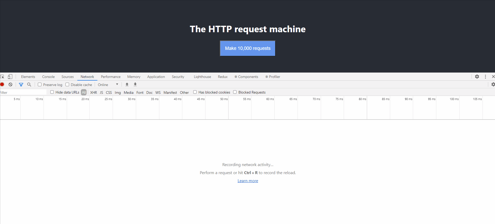
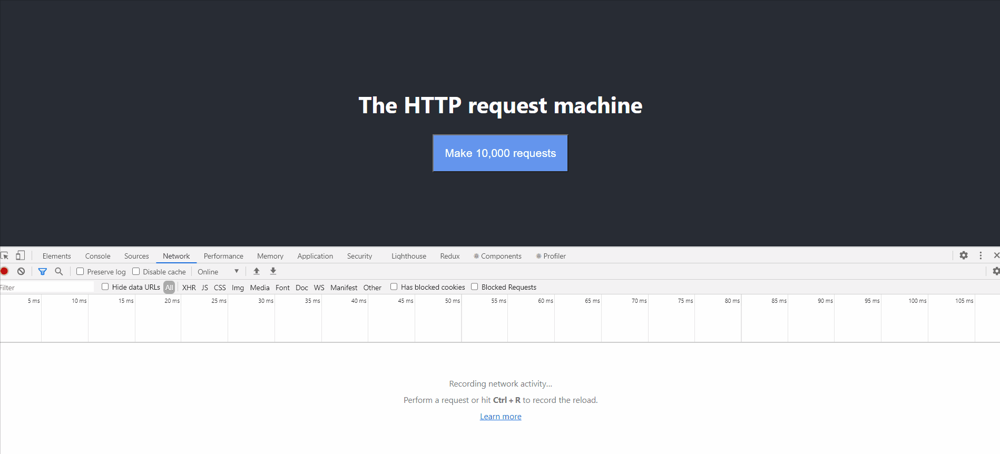

# Throttling data requests with React Hooks

When an application loads data, typically relatively few HTTP requests will be made.  For example, if we imagine we're making a student administration application, then an "view" screen might make a single HTTP request to load that student's data before displaying it.

Occasionally there's a need for an application to make a large number of HTTP requests.  Consider a reporting application which loads data and then aggregates it for presentation purposes.

This need presents two interesting problems to solve:

1. how do we load data gradually?
2. how do we present loading progress to users?

This post will talk about how we can tackle these and demonstrate using a custom React Hook.

## Let's bring Chrome to its knees

We'll begin our journey by spinning up a TypeScript React app with [Create React App](https://create-react-app.dev/):

```shell
npx create-react-app throttle-requests-react-hook --template typescript
```

Because we're going to be making a number of asynchronous calls, we're going to simplify the code by leaning on the widely used [`react-use`](https://github.com/streamich/react-use) for a [`useAsync`](https://github.com/streamich/react-use/blob/master/docs/useAsync.md) hook.

```shell
cd throttle-requests-react-hook
yarn add react-use
```

We'll add the following to the `App.css` file:

```css

.App-labelinput > * {
  margin: 1em;
}

.App-link {
  color: #61dafb;
}

.App-button {
  font-size: calc(10px + 2vmin);
  padding: 1em;
  background-color: cornflowerblue;
  color: #ffffff;
  text-align: center;
}

.App-results {
  display: grid;
  grid-template-columns: repeat(auto-fill,minmax(160px, 1fr));
}
```

Then we'll replace the `App.tsx` contents with this:

```tsx
import React, { useState } from "react";
import { useAsync } from "react-use";
import "./App.css";

function use10_000Requests(startedAt: string) {
  const responses = useAsync(async () => {
    if (!startedAt) return;

    // make 10,000 unique HTTP requests
    const results = await Promise.all(
      Array.from(Array(10_000)).map(async (_, index) => {
        const response = await fetch(
          `/manifest.json?querystringValueToPreventCaching=${startedAt}_request-${index}`
        );
        const json = await response.json();
        return json;
      })
    );

    return results;
  }, [startedAt]);

  return responses;
}


function App() {
  const [startedAt, setStartedAt] = useState("");
  const responses = use10_000Requests(startedAt);

  return (
    <div className="App">
      <header className="App-header">
        <h1>The HTTP request machine</h1>
        <button
          className="App-button"
          onClick={(_) => setStartedAt(new Date().toISOString())}
        >
          Make 10,000 requests
        </button>
        {responses.loading && <div>{progressMessage}</div>}
        {responses.error && <div>Something went wrong</div>}
        {responses.value && (
          <div className="App-results">
            {responses.value.length} requests completed successfully
          </div>
        )}
      </header>
    </div>
  );
}

export default App;
```

The app that we've built is very simple; it's a button which, when you press it, fires 10,000 HTTP requests in parallel using the [Fetch API](https://developer.mozilla.org/en-US/docs/Web/API/Fetch_API).  The data being requested in this case is an arbitrary JSON file; the manifest.json in this case.  If you look closely you'll see we're doing some querystring tricks with our URL to avoid getting cached data.
 
In fact, for this demo we're not interested in the results of these HTTP requests; rather we're interested in how the browser copes with this approach. (Spoiler: not well!) It's worth considering that a browser requesting a text file from the a server running on the same machine as the browser is likely to be as performant as it gets.

So we'll run `yarn start` and got to http://localhost:3000 to get to the app. Running with Devtools open results in the following unhappy affair:



The GIF above has actually been edited significantly for length. In reality it took 20 seconds on my machine for the first request to be fired, prior to that Chrome was unresponsive. When requests do start to fire, a significant number fail with `net::ERR_INSUFFICIENT_RESOURCES`.  Further to that, those requests that are fired sit in "Stalled" state prior to being executed.  This is a consequence of [Chrome obeying it's queueing rules for HTTP requests](https://developers.google.com/web/tools/chrome-devtools/network/reference#timing):

> There are already six TCP connections open for this origin, which is the limit. Applies to HTTP/1.0 and HTTP/1.1 only.

In summary, the problems with our current approach are:

1. the browser becoming unresponsive
2. failing HTTP requests due to insufficient resources
3. no information displayable to the user around progress

## Throttle me this

Instead of hammering the browser by firing all the requests at once, we could instead implement a throttle.  A throttle is a mechanism which allows you to limit the rate at which operations are performed.  In this case we want to limit the rate at which HTTP requests are made. A throttle will tackle problems 1 and 2 - essentially keeping the browser free and easy and ensuring that requests are all successfully sent.  We also want to keep our users informed around how progress is going.  It's time to unveil the `useThrottleRequests` hook:

```ts
import { useMemo, useReducer } from "react";
import { AsyncState } from "react-use/lib/useAsync";

/** Function which makes a request */
export type RequestToMake = () => Promise<void>;

/**
 * Given an array of requestsToMake and a limit on the number of max parallel requests
 * queue up those requests and start firing them
 * - inspired by Rafael Xavier's approach here: https://stackoverflow.com/a/48007240/761388
 *
 * @param requestsToMake
 * @param maxParallelRequests the maximum number of requests to make - defaults to 6
 */
async function throttleRequests(
  requestsToMake: RequestToMake[],
  maxParallelRequests = 6
) {
  // queue up simultaneous calls
  const queue: Promise<void>[] = [];
  for (let requestToMake of requestsToMake) {
    // fire the async function, add its promise to the queue,
    // and remove it from queue when complete
    const promise = requestToMake().then((res) => {
      queue.splice(queue.indexOf(promise), 1);
      return res;
    });
    queue.push(promise);

    // if the number of queued requests matches our limit then
    // wait for one to finish before enqueueing more
    if (queue.length >= maxParallelRequests) {
      await Promise.race(queue);
    }
  }
  // wait for the rest of the calls to finish
  await Promise.all(queue);
}

/**
 * The state that represents the progress in processing throttled requests
 */
export type ThrottledProgress<TData> = {
  /** the number of requests that will be made */
  totalRequests: number;
  /** the errors that came from failed requests */
  errors: Error[];
  /** the responses that came from successful requests */
  values: TData[];
  /** a value between 0 and 100 which represents the percentage of request that have been completed (whether successfully or not) */
  percentageLoaded: number;
  /** whether the throttle is currently processing requests */
  loading: boolean;
};

function createThrottledProgress<TData>(
  totalRequests: number
): ThrottledProgress<TData> {
  return {
    totalRequests,
    percentageLoaded: 0,
    loading: false,
    errors: [],
    values: [],
  };
}

/**
 * A reducing function which takes the supplied `ThrottledProgress` and applies a new value to it
 */
function updateThrottledProgress<TData>(
  currentProgress: ThrottledProgress<TData>,
  newData: AsyncState<TData>
): ThrottledProgress<TData> {
  const errors = newData.error
    ? [...currentProgress.errors, newData.error]
    : currentProgress.errors;

  const values = newData.value
    ? [...currentProgress.values, newData.value]
    : currentProgress.values;

  const percentageLoaded =
    currentProgress.totalRequests === 0
      ? 0
      : Math.round(
          ((errors.length + values.length) / currentProgress.totalRequests) * 100
        );

  const loading =
    currentProgress.totalRequests === 0
      ? false
      : errors.length + values.length < currentProgress.totalRequests;

  return {
    totalRequests: currentProgress.totalRequests,
    loading,
    percentageLoaded,
    errors,
    values,
  };
}

type ThrottleActions<TValue> =
  | {
      type: "initialise";
      totalRequests: number;
    }
  | {
      type: "requestSuccess";
      value: TValue;
    }
  | {
      type: "requestFailed";
      error: Error;
    };

/**
 * Create a ThrottleRequests and an updater
 */
export function useThrottleRequests<TValue>() {
  function reducer(
    throttledProgressAndState: ThrottledProgress<TValue>,
    action: ThrottleActions<TValue>
  ): ThrottledProgress<TValue> {
    switch (action.type) {
      case "initialise":
        return createThrottledProgress(action.totalRequests);

      case "requestSuccess":
        return updateThrottledProgress(throttledProgressAndState, {
          loading: false,
          value: action.value,
        });

      case "requestFailed":
        return updateThrottledProgress(throttledProgressAndState, {
          loading: false,
          error: action.error,
        });
    }
  }

  const [throttle, dispatch] = useReducer(
    reducer,
    createThrottledProgress<TValue>(/** totalRequests */ 0)
  );

  const updateThrottle = useMemo(() => {
    /**
     * Update the throttle with a successful request
     * @param values from request
     */
    function requestSucceededWithData(value: TValue) {
      return dispatch({
        type: "requestSuccess",
        value,
      });
    }

    /**
     * Update the throttle upon a failed request with an error message
     * @param error error
     */
    function requestFailedWithError(error: Error) {
      return dispatch({
        type: "requestFailed",
        error,
      });
    }

    /**
     * Given an array of requestsToMake and a limit on the number of max parallel requests
     * queue up those requests and start firing them
     * - based upon https://stackoverflow.com/a/48007240/761388
     *
     * @param requestsToMake
     * @param maxParallelRequests the maximum number of requests to make - defaults to 6
     */
    function queueRequests(
      requestsToMake: RequestToMake[],
      maxParallelRequests = 6
    ) {
      dispatch({
        type: "initialise",
        totalRequests: requestsToMake.length,
      });

      return throttleRequests(requestsToMake, maxParallelRequests);
    }

    return {
      queueRequests,
      requestSucceededWithData,
      requestFailedWithError,
    };
  }, [dispatch]);

  return {
    throttle,
    updateThrottle,
  };
}
```

The `useThrottleRequests` hook returns 2 properties:

- `throttle` - a `ThrottledProgress<TData>` that contains how far through the number of requests being made we are including the responses and errors obtained.
- `updateThrottle` - an object which exposes 3 functions:
  - `queueRequests` - the function to which you pass the requests that should be queued and executed in a throttled fashion
  - `requestSucceededWithData` - the function which is called if a request succeeds to provide the data
  - `requestFailedWithError` - the function which is called if a request fails to provide the error

That's a lot of words to describe our `useThrottleRequests` hook.  Let's look at what it looks like by migrating our `use10_000Requests` hook to (no pun intended) use it. Here's a new implementation of `App.tsx`:

```tsx
import React, { useState } from "react";
import { useAsync } from "react-use";
import { useThrottleRequests } from "./useThrottleRequests";
import "./App.css";

function use10_000Requests(startedAt: string) {
  const { throttle, updateThrottle } = useThrottleRequests();
  const [progressMessage, setProgressMessage] = useState("not started");

  useAsync(async() => {
      if (!startedAt) return;

      setProgressMessage("preparing");

      const requestsToMake = Array.from(Array(10_000)).map(
        (_, index) => async () => {
          try {
            setProgressMessage(`loading ${index}...`);

            const response = await fetch(
              `/manifest.json?querystringValueToPreventCaching=${startedAt}_request-${index}`
            );
            const json = await response.json();
            updateThrottle.requestSucceededWithData(json);

            return json;
          } catch (error) {
            updateThrottle.requestFailedWithError(error);
            console.error(`failed to load ${index}`, error);
          }
        }
      );

      await updateThrottle.queueRequests(requestsToMake);

  }, [startedAt, updateThrottle, setProgressMessage]);

  return { throttle, progressMessage };
}

function App() {
  const [startedAt, setStartedAt] = useState("");

  const { progressMessage, throttle } = use10_000Requests(startedAt);

  return (
    <div className="App">
      <header className="App-header">
        <h1>The HTTP request machine</h1>
        <button
          className="App-button"
          onClick={(_) => setStartedAt(new Date().toISOString())}
        >
          Make 10,000 requests
        </button>
        {throttle.loading && <div>{progressMessage}</div>}
        {throttle.values.length > 0 && (
          <div className="App-results">
            {throttle.values.length} requests completed successfully
          </div>
        )}
        {throttle.errors.length > 0 && (
          <div className="App-results">
            {throttle.errors.length} requests errored
          </div>
        )}
      </header>
    </div>
  );
}

export default App;
```

Looking at the new `use10_000Requests` hook, there's a few subtle differences to our prior implementation.  First of all, we're now exposing the `throttle`; a `ThrottleProgress<TData>` which exposes the following information:

- `totalRequests` - the number of requests that will be made
- `errors` - the errors that came from failed requests
- `values` - the responses that came from successful requests
- `percentageLoaded` - a value between 0 and 100 which represents the percentage of request that have been completed (whether successfully or not)
- `loading` - whether the throttle is currently processing requests

Our updated hook also exposes a `progressMessage` which is a simple string stored with `useState` that we update as our throttle runs.  In truth the information being surfaced in this case isn't that interesting.  This is in place just to illustrate that you could capture some data from your requests as they complete for display purposes; a running total for instance.

So, how does our new hook approach perform?



If we look back at the problems we faced with the prior approach, how do we look?

1. ~~the browser becoming unresponsive~~ - the browser remains responsive.
2. ~~failing HTTP requests due to insufficient resources~~ - the browser does not experience failing HTTP requests.
3. ~~no information displayable to the user around progress~~ - details of progress are displayed to the user throughout.


## What shall we build?

Let us consider a batch loading scenario we might want to tackle.  We're going to build an application which, given a repo on GitHub, lists all the contributors blogs.

We can build this thanks to the excellent [GitHub REST API](https://docs.github.com/en/free-pro-team@latest/rest). It exposes two endpoints of interest given our goal.

### 1. List repository contributors

[List repository contributors](https://docs.github.com/en/free-pro-team@latest/rest/reference/repos#list-repository-contributors) lists contributors to the specified repository at this URL: `GET https://api.github.com/repos/{owner}/{repo}/contributors`.  The response is an array of objects, crucially featuring a `url` property that points to the user in question's API endpoint:

```js
[
  // ...
  {
    // ...
    "url": "https://api.github.com/users/octocat",
    // ...
  },
  // ...
]
```

### 2. Get a user

[Get a user](https://docs.github.com/en/free-pro-team@latest/rest/reference/users#get-a-user) is the API that the `url` property above is referring to.  When called it returns an object the publicly available information about a user:

```js
{
    "login": "octocat",
    "id": 583231,
    "node_id": "MDQ6VXNlcjU4MzIzMQ==",
    "avatar_url": "https://avatars3.githubusercontent.com/u/583231?v=4",
    "gravatar_id": "",
    "url": "https://api.github.com/users/octocat",
    "html_url": "https://github.com/octocat",
    "followers_url": "https://api.github.com/users/octocat/followers",
    "following_url": "https://api.github.com/users/octocat/following{/other_user}",
    "gists_url": "https://api.github.com/users/octocat/gists{/gist_id}",
    "starred_url": "https://api.github.com/users/octocat/starred{/owner}{/repo}",
    "subscriptions_url": "https://api.github.com/users/octocat/subscriptions",
    "organizations_url": "https://api.github.com/users/octocat/orgs",
    "repos_url": "https://api.github.com/users/octocat/repos",
    "events_url": "https://api.github.com/users/octocat/events{/privacy}",
    "received_events_url": "https://api.github.com/users/octocat/received_events",
    "type": "User",
    "site_admin": false,
    "name": "The Octocat",
    "company": "@github",
    "blog": "https://github.blog",
    "location": "San Francisco",
    "email": null,
    "hireable": null,
    "bio": null,
    "twitter_username": null,
    "public_repos": 8,
    "public_gists": 8,
    "followers": 3255,
    "following": 9,
    "created_at": "2011-01-25T18:44:36Z",
    "updated_at": "2020-09-25T14:02:08Z"
}
```

## Blogging devs v1.0

Finally let's replace the existing `App.tsx` with:

```tsx
import React, { useCallback, useState } from "react";
import { useAsync } from "react-use";
import "./App.css";

function App() {
  // The owner and repo to query; we're going to default
  // to using DefinitelyTyped as an example repo as it 
  // is one of the most contributed to repos on GitHub
  const [owner, setOwner] = useState("DefinitelyTyped");
  const [repo, setRepo] = useState("DefinitelyTyped");
  const handleOwnerChange = useCallback(
    (event: React.ChangeEvent<HTMLInputElement>) =>
      setOwner(event.target.value),
    [setOwner]
  );
  const handleRepoChange = useCallback(
    (event: React.ChangeEvent<HTMLInputElement>) => setRepo(event.target.value),
    [setRepo]
  );

  const contributorsUrl = `https://api.github.com/repos/${owner}/${repo}/contributors`;

  const [contributorsUrlToLoad, setUrlToLoad] = useState("");
  const contributors = useAsync(async () => {
    if (!contributorsUrlToLoad) return;

    // load contributors from GitHub
    const response = await fetch(contributorsUrlToLoad);
    const result: { url: string }[] = await response.json();

    // For each entry in result, retrieve the given user from GitHub
    const results = await Promise.all(
      result.map(({ url }) => fetch(url).then((response) => response.json()))
    );

    return results;
  }, [contributorsUrlToLoad]);

  return (
    <div className="App">
      <header className="App-header">
        <h1>Blogging devs</h1>
        <div className="App-labelinput">
          <label htmlFor="owner">GitHub Owner</label>
          <input
            id="owner"
            type="text"
            value={owner}
            onChange={handleOwnerChange}
          />
        </div>
        <div className="App-labelinput">
          <label htmlFor="repo">GitHub Repo</label>
          <input
            id="repo"
            type="text"
            value={repo}
            onChange={handleRepoChange}
          />
        </div>
        <p>
          <a
            className="App-link"
            href={contributorsUrl}
            target="_blank"
            rel="noopener noreferrer"
          >
            {contributorsUrl}
          </a>
        </p>
        <button
          className="App-button"
          onClick={(e) => setUrlToLoad(contributorsUrl)}
        >
          Load contributors from GitHub
        </button>
        {contributors.loading ? "Loading..." : null}
        {contributors.error ? "Something went wrong" : null}
        {contributors.value
          ? contributors.value.map((cont) => (
              <li>
                {cont.login} - {cont.blog}
              </li>
            ))
          : null}
      </header>
    </div>
  );
}

export default App;
```


#### Browser limitations

The simplest approach to tacking making multiple requests 

https://stackoverflow.com/questions/985431/max-parallel-http-connections-in-a-browser


Recently I started to hit the limits of what our servers could sensibly cater for in a request.  Not in terms of amounts of data surfaced; rather in terms of the length of time it was taking for requests to come back.  What had previously (back in the days when no-one used our services) worked in a matter of seconds had miraculously grown into something that took minutes instead.  Oh to be popular!

I decided to implement a throttle mechanism to handle this.  The idea being to break down each previously large request into batches of short requests that, when the responses were brought together, would represent the same data as our previous large request was retrieving.

This mechanism would ease the load on the server. It was also have a secondary (and lovely) effect.  It would provide a way by which we could provide a meaningful progress indicator to clients. If you know that you're going to load 900 requests and you know how many of those requests have been completed, then you have all you need to provide a "percentage done" mechanism.

#### Batch loading with React Hooks

My front end was a React application; entirely comprised of hooks.  The question I found myself pondering was this: what does a batch loading mechanism look like in hooks? Well, our data loading mechanism had already been abstracted into a hook.  Our hooks already built atop [`react-use`'s `AsyncState<T>`](https://github.com/streamich/react-use/blob/master/src/useAsyncFn.ts) which models the state surrounding an asynchronous operation such as loading data in a really lovely way.
